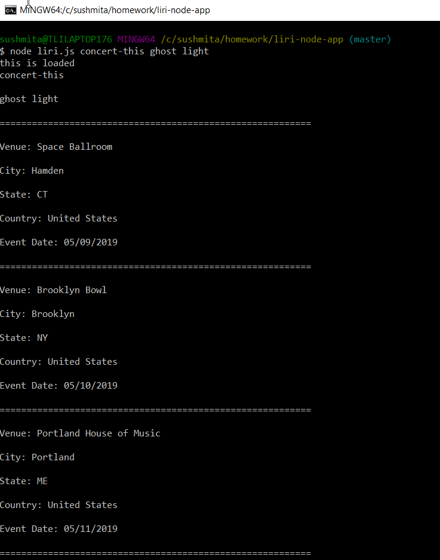
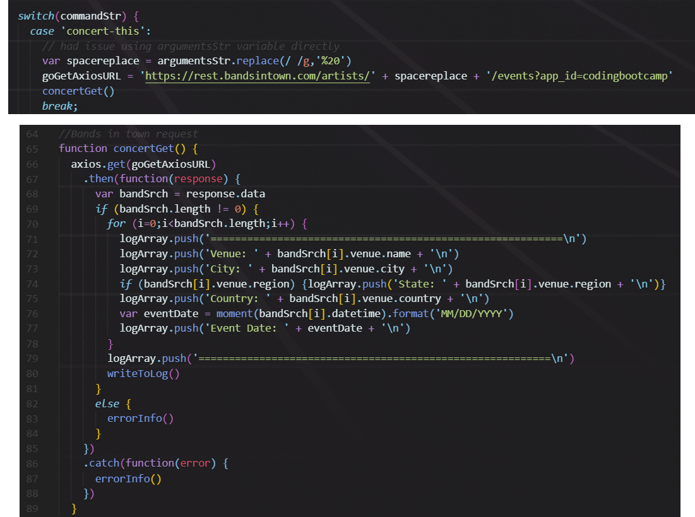

# liri-node-app

## Overview

### Liri is like Siri!
We can use this application to get info :

      about               from
      __________________________________
      Concert            bandsintown
      song               spotify
      movie              imdb

## Packages used :
      axios
      fs
      moment
      bandsintown
      spotify
      imdb

## Logic :
#### Concert

##### COMMAND =>  node liri.js concert-this ghost light
##### OUTPUT =>

##### CODE =>

